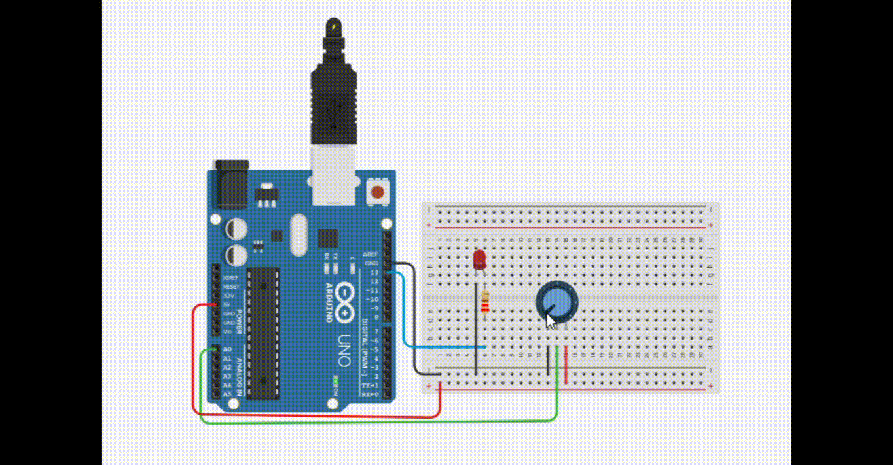

# Controlando a velocidade do pisca-pisca
 Neste experimento faremos a leitura do potenciômetro conectado a porta analógica 0 e um LED conectado a porta digital 13. O valor lido do potenciômetro será a velocidade do pisca-pisca do LED, ou seja o seu tempo de atraso.  

 <b><a href="https://www.tinkercad.com/things/73fU8Ew7fLn">Clique Aqui</a></b> para ver o projeto em Tinkercard.com!
 
## Lista de componentes:

- 1  Arduíno UNO R3
- 1  Um cabo de conexão USB
- 1  Placa de prototipação (Protoboard)
- 1  Potenciômetro 
- 1  LED
- 1  Resistor de 220 Ω ohms 
- 7  Jumpers (macho-macho)

## Esquema do projeto

